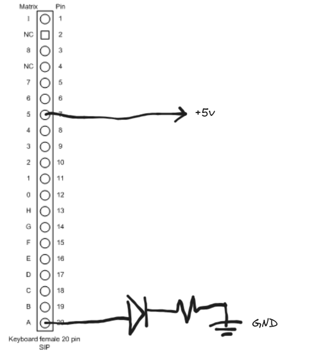
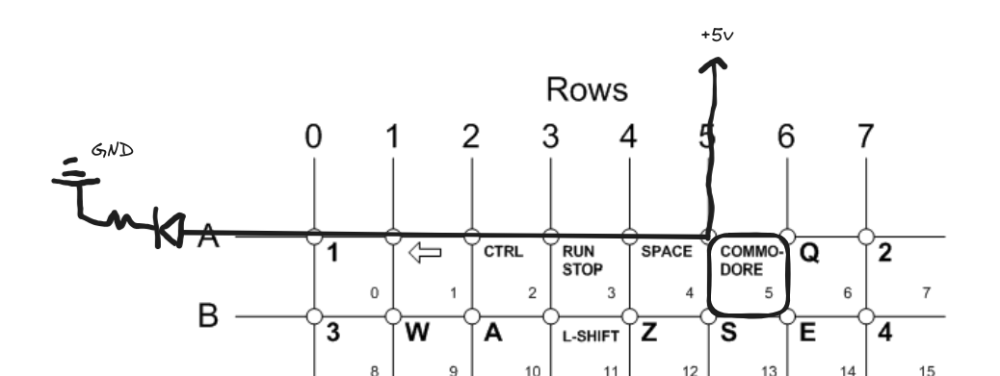
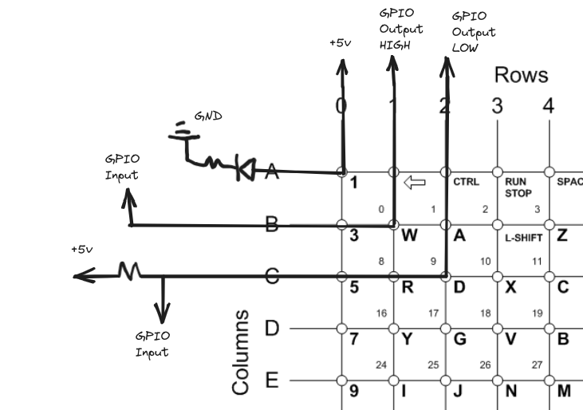
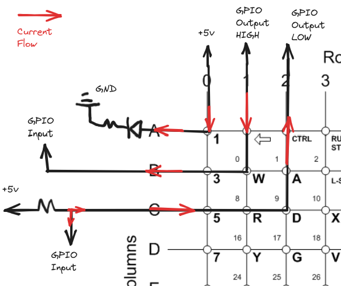
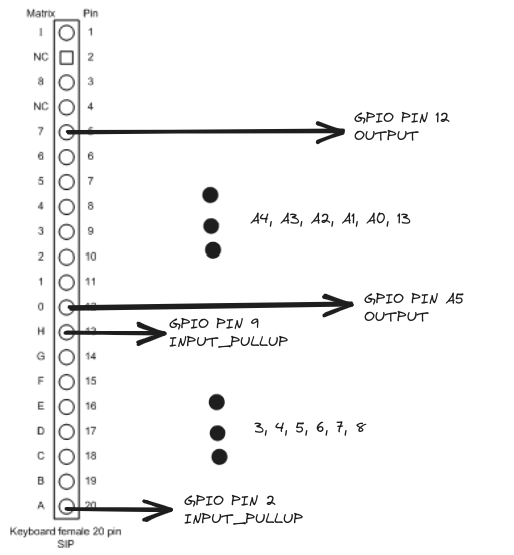

Much of this doc is written in psudo-note taking form and is not intended to be viewed as a formal write-up. I am a budding hobbyist in electronics with little formal background in computer science. Some of these notes will likely cover extremely simple concepts and there will probably be some errors or incorrect deductions and methods.

## The Key Matrix

Typically a switch is read or used such that there is one input to the switch and one output. When we apply positive voltage to one side and negative voltage to the other, we should see current flow when the switch is pressed. This is fine for a few simple inputs but a keyboard can have over 60 individual keys. If we had one input for each key and one output that's 120 individual inputs and outputs to work with. What we can do instead is arrange the keys into a matrix. Matrix keyboards layout all inputs in a series of rows and columns (inputs and outputs) such that each key exists at a meeting between one row and one column. See Figure 1 below for a wiring representation (ignore the resistors tying the columns up to +5v for now). With this matrix layout, we can handle up to N^2 keys (where N is equal to the number of rows/columns) using only 2N inputs and outputs. So if we wanted to handle 64 different keys, we could do that with 8 rows and columns. 

8 Rows
8 Columns
16 total IO
8^2 = 64 keys

#### Fig. 1


The Commodore VIC 20 I'm using to learn these concepts and tinker on has a 20-pin SIP connector with 18 of those pins populated (keyboard pins 2 and 4 on the keyboard connector are empty and not used for anything). We get an Arduino involved soon so I'll try to ensure I specify about what pins i'm talking about at any given moment, either keyboard pins or Arduino pins. First order of business was figuring out the layout of the matrix for this keyboard. With 18 keyboard pins we could theoretically scan through 81 (18/2 = 9. 9^2 = 81) different keys but our keyboard only has 65. Figure 2 below is a diagram I found for a commodore keyboard matrix.

#### Fig. 2


```
|-------------------------------------------------------------------|
|   |   A   |   B   |   C   |   D   |   E   |   F   |   G   |   H   |
|---|-------|-------|-------|-------|-------|-------|-------|-------|
| 0 | 1     | 3     | 5     | 7     | 9     | +     | $GBP  | DEL   |
| 1 | <-    | W     | R     | Y     | I     | P     | *     | RTRN  |
| 2 | CTRL  | A     | D     | G     | J     | L     | ;     | C-LR  |
| 3 | RUN   | LSHFT | X     | V     | N     | ,     | /     | C-UD  |
| 4 | SPACE | Z     | C     | B     | M     | .     | RSHFT | F1    |
| 5 | C=    | S     | F     | H     | K     | :     | =     | F3    |
| 6 | Q     | E     | T     | U     | O     | @     | UP    | F5    |
| 7 | 2     | 4     | 6     | 8     | 0     | -     | HOME  | F7    |
|-------------------------------------------------------------------|

   | I
---|---------
 8 | Restore
```
This reference image proved invaluable in helping me understand how to get started going through the matrix. Note that it not only has the logical layout of the key in the matrix but also has a pin-out of the 20-pin keyboard connector and reveals the mystery of why we have 18 in/out pins but only 64 keys. It shows that Row 8 and Column I are dedicated to a single key, the Restore key. So, pins 5-20 on our keyboard connector make up the key matrix, with pins 5-12 acting as the rows and pins 13-20 acting as the columns. Keyboard pin 1 and 3 connects to only the restore key; and pins 2 and 4 aren't populated as mentioned earlier.

Throughout the first part of these notes we won't concern ourselves with every single row and column right away. Rather, we'll only focus on controlling a single row pin and monitoring a single column pin. In this way, we'll only see a change in state on the column when the key at the row we're driving and column we're watching is pressed or released. 

I tested each key in the matrix by manually passing power through a row pin and watching the columns with LEDs. For example, I would connect keyboard pin 20 (which maps to column pin A) to an LED in sequence with a resistor going to ground. I would then tie one of the logical row pins, for instance keyboard pin 7 (row 5) to +5v. The LED would illuminate whenever the row 5, column A key was pressed (the "COMMODORE" key on our keyboard). See figures 3 and 4 for some schematic overview. I used an array of LEDs connected to each of the column pins and one by one powered each of the rows. With this method I was able to confirm that each button on the keyboard worked and that the pin-out and key map I found was accurate.

#### Fig. 3
![[PINOUT_TEST.png]]


#### Fig. 4
![[example1.png]]


## Adding Arduino

An array of LEDs was great for confirming every key completes a circuit in the matrix but it's not very useful. One of the goals of this project is to be able to use the keyboard *AS* as keyboard. I would like to be able to connect the keyboard to a computer and press a key and have that key be understood as a computer would understand any other keyboard. So, our next step will be getting a microcontroller involved to help us read this matrix and hopefully pass keyboard commands for us.

#### Fig. 5
![[arduino_schematics_pins.jpg]]


To get started, lets start in the same place as the last test. We'll connect keyboard pin 7 (matrix row 5) to +5v just like we did before. This time, we'll remove the LED and instead connect keyboard pin 20 (column A) to GPIO pin 2 on an Arduino UNO. See Figure 5 for a reference of the Arduino pins. We'll have the Arduino supply the +5v and GND as needed. Now lets write some code to see the state of the pin:

```cpp
int COLUMN_PIN = 2; // Declare the Arduino GPIO pins in use

// The setup() function runs once when the Arduino starts
void setup() {
  Serial.begin(9600); // Start a serial connection over USB

  // Turn our declared pin into an input
  // so we can "read" it
  pinMode(COLUMN_PIN, INPUT); 
}

// The loop() function runs repeatedly after the setup() function finishes
void loop() {
  // Read the state of the pin
  // pin_state will be 1 if there's a detected signal and 0 otherwise
  int pin_state = digitalRead(COLUMN_PIN);

  // Prints out "Pin state: 0" to monitor when key not pressed
  // Prints out "Pin state: 1" to monitor when key is pressed
  Serial.print("Pin state: ");
  Serial.print(pin_state);
  Serial.print("\n");
}
```

When we compile and upload this sketch to the Arduino and pull up the serial monitor on the computer the Arduino is connected to, we can see the state of the pin change when we press the COMMODORE key but not when any other key is pressed.

We're going to have to operate the rows so lets take the keyboard pin we were tying to +5v and connect it to one of the pins on the Arduino. We'll use pin A0 (can also be denoted as pin 14) which should work fine and helps us keep some mental separation.

```cpp
int COLUMN_PIN = 2;
int ROW_PIN = A0; // Declare our row pin

void setup() {
  Serial.begin(9600);
  pinMode(COLUMN_PIN, INPUT);

  // Set our row pin as output and bring it high
  pinMode(ROW_PIN, OUTPUT);
  digitalWrite(ROW_PIN, HIGH);
}

void loop() {
  int pin_state = digitalRead(COLUMN_PIN);

  Serial.print("Pin state: ");
  Serial.print(pin_state);
  Serial.print("\n");
}
```

When programming for Arduino, a pin set to output is one we can control. We can set it high which is like tying it to 5v, and we can set it low which is like tying it to ground. A pin set as an input isn't directly controlled, but we can read whatever signal is on it to see if it's high or low (represented as 1 or 0 when read and stored as a variable in our code).

With our current setup, we've been bringing row pins high watching column pins go high on the other side when the corresponding key is pressed. However, when reading and looking at other similar projects, it seems to be more common to have the columns tied high with pull-up resistors and to sequentially bring the row pins low as they're scanned and high otherwise. We still monitor the column side, but now what we'll see is a high signal when no key is pressed, and a low signal when the key is pressed. 

See Figure 6 for a comparison of how we've been using the column and row pins as we go. Note, we're still only concerning ourselves with one column pin and one row pin but we'll expand into the rest of them soon. If we change the sketch we just wrote to bring the row pin low instead of high, we should see the same thing we were seeing before on the serial monitor but with output showing 1 when no key is pressed and 0 when the correct key is pressed. 

#### Fig. 6
![[differences.png]]


You might notice this means that current is going to flow opposite to how it was when we were first testing (See figure 7). There's no diodes or anything on the keyboard i'm working with to prevent ghosting or prevent current flowing in any direction.

#### Fig. 7
![[current.png]]


Connecting each column pin to a pull-up resistor to keep our outputs high would be a little cumbersome. Thankfully designing circuits this way is common and the MCU in the Arduino has internal pull-up resistors so that it can act as a pull-up and input at the same time. Here's a video quickly going over the distinction and how to use the pull-up resistors.


Here is finally what we have for reading a single row and column at a time:

```cpp
int COLUMN_PIN = 2;
int ROW_PIN = A0;

void setup() {
  Serial.begin(9600);

  // Set our column as an INPUT_PULLUP
  // This allows it to be used as an input
  // that also ties the line to a pull-up resistor
  pinMode(COLUMN_PIN, INPUT_PULLUP);

  // We're now looking for row pins going low
  pinMode(ROW_PIN, OUTPUT);
  digitalWrite(ROW_PIN, LOW);

  // Ideally, all the other row pins should
  // be brought high. We'll tie them to 5v physically
}

void loop() {
  int pin_state = digitalRead(COLUMN_PIN);

  Serial.print("Pin state: ");
  Serial.print(pin_state);
  Serial.print("\n");
}
```


## Connect All the Pins

Now that we've sorted out how to read just one key off of a row and column, lets now connect all the other rows and columns so that we can try to read every key. We're still going to ignore keyboard pins 1 and 3 so we won't get anything from the Restore key.

First, let's decide our pins. We've been using Arduino pin 2 for our column and Arduino pin A0 (14) for our row. We'll keep counting up for the columns and use 2, 3, 4, 5, 6, 7, 8, and 9. Remember, we can't use pin 0 or 1 while we're using the serial monitor and we're still interested in looking at that. For our rows, we can use up the remaining "A" pins but then we'll have to use some of the pins on the other side near our columns. To keep separation, we'll use pin 13 and count down to fill the rest. That gives us pins A5, A4, A3, A2, A1, A0, 13, 12. With the serial monitor active, we'll only have 2 pins left on the Arduino to play with (10 and 11) which we could connect the restore key to but as mentioned we'll come back to that.

![[arduino-keyboard-pinout.png]]


Let's go ahead and start setting up the code:

```cpp
int COL_ARRAY[8] = {2, 3, 4, 5, 6, 7, 8, 9}; // Columns A-H in order
int ROW_ARRAY[8] = {A5, A4, A3, A2, A1, A0, 13, 12}; // Rows 0-7 in order

void setup() {
  Serial.begin(9600);

  // We use a for loop to iterate through each pin listed in our arrays.
  for (int i = 0; i < 8; i++) {
    pinMode(COL_ARRAY[i], INPUT_PULLUP); // set every column pin as input
    pinMode(ROW_ARRAY[i], OUTPUT); // set every row pin as outpit
    digitalWrite(ROW_ARRAY[i], HIGH); // set all the row pins high
  }
}

void loop() {
}
```

Now we need a way to scan through all of the keys in order to see if any key is being pressed. As mentioned before, we control the rows and monitor the columns. So first we need to go through each row and bring them low one a a time and back high as we move on. Let's see what that looks like:

```cpp
void loop() {
  for (int row = 0; row < 8; row++) {
    digiatlWrite(ROW_ARRAY[row], LOW);

	// In here we'll have to read the columns

    digiatlWrite(ROW_ARRAY[row], HIGH);
  }
}
```

Simple enough. Now, as we go through each row we scan every column. In this way we effectively scan through every single key.

```cpp
void loop() {
  int pin_state;

  for (int row = 0; row < 8; row++) {
    digiatlWrite(ROW_ARRAY[row], LOW);

    for (int col = 0; col < 8; col++) {
      pin_state = digitalRead(COL_ARRAY[col]);
    }

    digiatlWrite(ROW_ARRAY[row], HIGH);
  }
}
```
